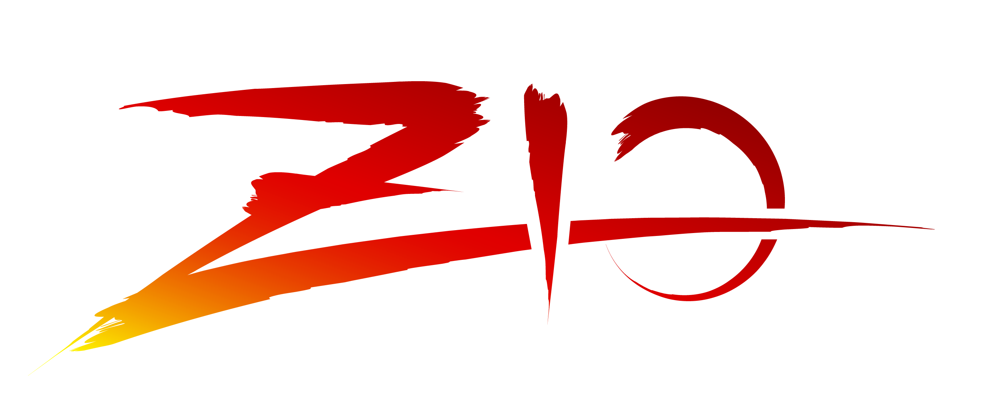

# ZIO

ZIO is a type-safe functional effect in Scala for asynchronous and concurrent programming. To learn more about ZIO, visit [zio.dev](zio.dev).

## ZIO Ecosystem

ZIO has a growing ecosystem of libraries and tools for building next-generation reactive applications on JVM, Scala.js, and Scala Native. Here is the overview of its ecosystem:

1. Official ZIO libraries are hosted in the [ZIO organization](https://github.com/zio/) on Github and maintained by core contributors to ZIO. We have a [quick overview](http://zio.dev/ecosystem/officials/) for these libraries on the ZIO website.

2. There is also a growing ecosystem of community-maintained libraries outside the ZIO organization. These are [listed](https://zio.dev/ecosystem/community/) on the ecosystem section of the ZIO website.

## Ecosystem Tracker

We have a [ZIO Ecosystem Tracker](https://zio-ecosystem.herokuapp.com/) that provides a comprehensive overview of each library in the ecosystem, including:

- What libraries are updated to the latest ZIO version? Every library which has a green checkmark is up to date. A yellow exclamation mark means that the library is not up to date and there are some work left to be done.
- What is the latest release of each library?
- What are the dependencies of each library?
- What other libraries are on top of a given library?
- It provides a copy-pasteable dependency configuration for each library.

## Project Status

Each project in the ZIO organization namespace has a _Stage Badge_ which indicates the current status of that project:

- **Production Ready**— The project is stable and already used in production. We can expect reliability for the implemented use cases.

- **Development**— The project already has RC or milestone releases but is still under active development. We should not expect full stability yet.

- **Experimental**— The project is not yet released, but an important part of the work is already done.

- **Research**— The project is at the design stage, with some sketches of work but nothing usable yet.

- **Concept**— The project is just an idea , and the development hasn't started yet.

- **Deprecated**— The project is not maintained anymore, and we don't recommend its usage.
